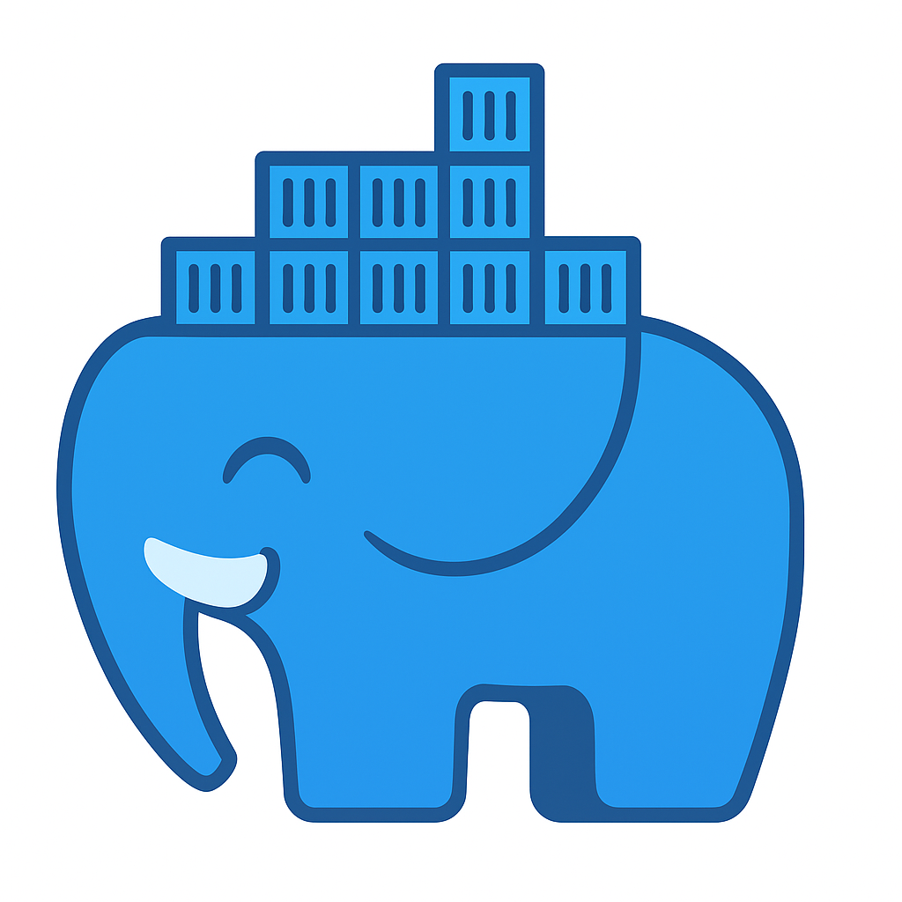
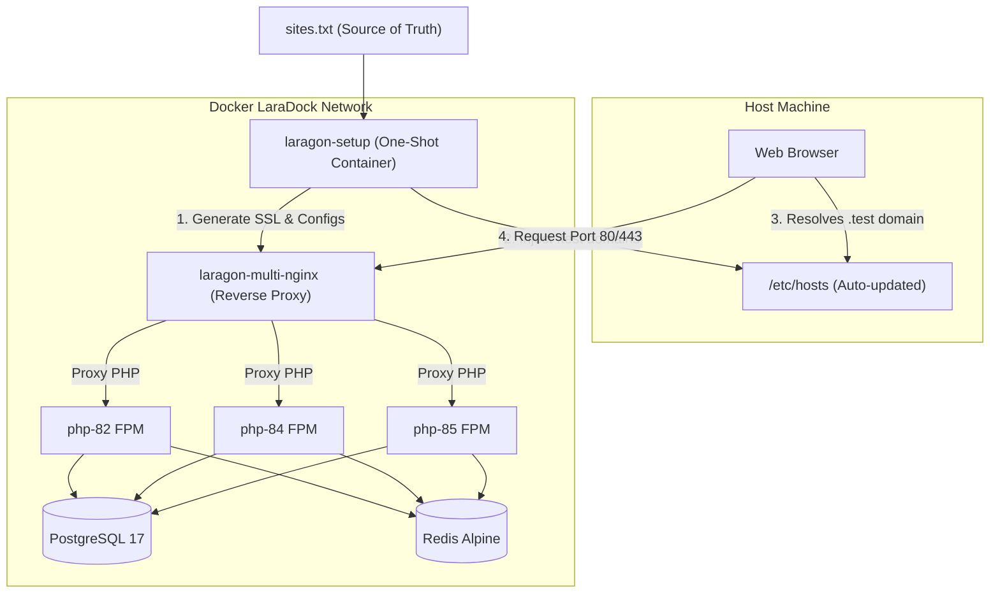

# ⚡ LaraDock (Linux Edition)


A powerful, Docker-based local development environment similar to **Laragon**, designed specifically for Linux developers. Enjoy zero-config multi-PHP routing, automatic trusted HTTPS certificates, and fully-automated host resolution!

Created by **kirito roy**.

---

## 🚀 Key Features

- **⚡ Multi-Version PHP FPM Support:** Run PHP 8.2, 8.4, and 8.5 side-by-side. Easily bind any project to its own PHP version.
- **🔒 Automated Trusted SSL/HTTPS:** Zero-touch SSL creation powered by `mkcert`. No browser warnings!
- **🛠️ Automatic Host Synchronization (`.test` TLD):** Zero hosts file editing! The environment automatically hooks into your host's `/etc/hosts` and registers domains on the fly.
- **🔀 Dynamic Nginx Routing:** Just add a domain in `sites.txt` and Nginx dynamically maps it to the public root of your project folder.
- **🐘 Production-Ready Databases:** Pre-configured with **Postgis/PostgreSQL 17** and **Redis** active by default (MySQL, MongoDB, RabbitMQ, and Node services ready to be uncommented).

---

## 📐 How it Works (Architecture)



---

## 📁 Workspace Structure

```text
Laragon/
├── projects/            # 📂 Add all your active projects here
├── nginx/               # ⚙️ Auto-generated configuration & SSL directory
│   ├── sites-enabled/   # └─ Virtual Host conf files (.test.conf)
│   └── ssl/             # └─ Trusted SSL Certificates (.crt / .key)
├── mkcert-ca/           # 🔑 Auto-generated Certificate Authority files
├── postgres_data/       # 🗄️ Persisted PostgreSQL database storage
├── docker-compose.yml   # 🐳 Docker Compose network definitions
├── auto-setup.sh        # 📜 Setup automation script
├── sites.txt            # 📝 Site registration registry
└── README.md
```

---

## 📖 User Manual & Setup Guide

### 1. Registering a Project

#### Step A: Add Project Folder

Place your project folder (e.g., `upms` or `eems`) directly inside the `./projects/` directory.

#### Step B: Add Database Configuration

Set up your database server connection in your project's `.env` file:

- **Host:** `postgres`
- **Port:** `5432`
- **Username:** `postgres`
- **Password:** `root`

#### Step C: Add Entry to `sites.txt`

Open `sites.txt` and define your project's domain and target PHP version in the format: `https://<folder_name>.<TLD>(php-<version>)`:

```text
https://upms.test(php-82)
https://service-desk.test(php-84)
```

> [!IMPORTANT]
> The setup script automatically derives the project directory name from the first segment of the domain name (e.g. `upms.test` maps to `./projects/upms/public/`).

---

### 2. Starting the Environment

To launch the system, run this single command in the project root:

## 🛠️ LaraDock CLI (The Premium Developer CLI Tool)

Instead of manually editing configuration files or typing long Docker Compose commands, use the fully integrated, custom **LaraDock CLI** (`laradock`).

### 1. Global System Installation

Install the utility globally on your host machine so you can run it from **any directory** on your filesystem:

```bash
# Run this inside the LaraDock project root folder
./laradock install
```

_You can now run `laradock` from anywhere! Restart your terminal shell or run `exec zsh` to activate rich Zsh autocompletions!_

---

### 2. Available Commands Reference

| Command                                   | Action                                                                                   |
| :---------------------------------------- | :--------------------------------------------------------------------------------------- |
| **`laradock list`**                       | Lists all active registered projects and mapped PHP versions in a beautiful CLI table.   |
| **`laradock add <domain> [php-version]`** | Register a new project and sync the environment. Defaults to `php-82`.                   |
| **`laradock remove <domain>`**            | Deregister a project, clean Nginx configs, delete SSL certs, and sync hosts.             |
| **`laradock up`**                         | Start all LaraDock containers in the background.                                         |
| **`laradock down`**                       | Stop and remove all containers.                                                          |
| **`laradock restart [service]`**          | Restart a specific service (e.g. `nginx`, `postgres`) or all services.                   |
| **`laradock ssh <service>`**              | Shell instantly into a running container (e.g. `php-82`, `php-84`, `node`, `postgres`).  |
| **`laradock trust`**                      | Trust the local SSL CA root certificate on your host machine.                            |
| **`laradock uninstall`**                  | Remove the global CLI, delete man pages, clear trusted CAs, and wipe hosts file mapping. |

---

## 📖 User Manual & Setup Guide

### 1. Registering a Project (The Modern Way)

#### Step A: Place Project Folder

Clone or place your project folder (e.g. `my-project`) inside the `./projects/` directory.

#### Step B: Add Site via CLI

```bash
laradock add my-project.test php-84
```

> [!NOTE]
> This command automatically:
>
> 1. Registers the project with PHP 8.4 inside `sites.txt`.
> 2. Runs the one-shot builder to compile custom trusted SSL certificates and Nginx config server blocks.
> 3. Dynamically synchronizes your host's `/etc/hosts` file.
> 4. Restarts Nginx to load the changes.

#### Step C: Open in Browser

Visit your secure project instantly:

```text
https://my-project.test
```

---

### 3. Activating Local SSL Trust (One-time Host Setup)

To make your local browser fully trust the generated HTTPS `.test` domains without security warnings:

Run the following command on your **host machine** to trust the newly generated Local CA:

### 2. Activating Local SSL Trust (One-time Host Setup)

To make your local host browser fully trust the generated HTTPS `.test` domains without security warnings:

```bash
laradock trust
```

_If you are using Firefox, also import `./mkcert-ca/rootCA.pem` under `Firefox Settings -> Certificates -> View Certificates -> Authorities -> Import`._

---

### 3. Running Composer & NPM Inside Docker

Always execute project dependencies inside the designated containers to keep your host environment clean.

#### 🐘 Running Composer Commands

```bash
# Shell instantly into the PHP container of your choice
laradock ssh php-82

# Navigate to your project folder inside the container and run Composer
cd upms
composer install
```

#### ⚡ Running NPM Commands

If you have uncommented the `node` service in your `docker-compose.yml`:

```bash
# Shell instantly into the Node.js container
laradock ssh node

# Navigate and run NPM scripts
cd upms
npm install
npm run dev
```

---

### 5. Accessing your Application

Open your browser and navigate directly to your secure URL:

```text
https://upms.test
```

### 4. Database Connection details

Set up your database server connection in your project's `.env` file:

- **Host:** `postgres`
- **Port:** `5432`
- **Username:** `postgres`
- **Password:** `root`
