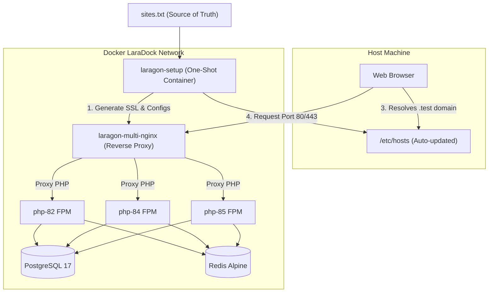

# ⚡ LaraDock (Linux Edition)

A powerful, Docker-based local development environment similar to **Laragon**, designed specifically for Linux developers. Enjoy zero-config multi-PHP routing, automatic trusted HTTPS certificates, and fully-automated host resolution!

Created by **kirito roy**.

---

## 🚀 Key Features

*   **⚡ Multi-Version PHP FPM Support:** Run PHP 8.2, 8.4, and 8.5 side-by-side. Easily bind any project to its own PHP version.
*   **🔒 Automated Trusted SSL/HTTPS:** Zero-touch SSL creation powered by `mkcert`. No browser warnings!
*   **🛠️ Automatic Host Synchronization (`.test` TLD):** Zero hosts file editing! The environment automatically hooks into your host's `/etc/hosts` and registers domains on the fly.
*   **🔀 Dynamic Nginx Routing:** Just add a domain in `sites.txt` and Nginx dynamically maps it to the public root of your project folder.
*   **🐘 Production-Ready Databases:** Pre-configured with **Postgis/PostgreSQL 17** and **Redis** active by default (MySQL, MongoDB, RabbitMQ, and Node services ready to be uncommented).

---

## 📐 How it Works (Architecture)



---

## 📁 Workspace Structure

```text
Laragon/
├── projects/            # 📂 Add all your active projects here
├── nginx/               # ⚙️ Auto-generated configuration & SSL directory
│   ├── sites-enabled/   # └─ Virtual Host conf files (.test.conf)
│   └── ssl/             # └─ Trusted SSL Certificates (.crt / .key)
├── mkcert-ca/           # 🔑 Auto-generated Certificate Authority files
├── postgres_data/       # 🗄️ Persisted PostgreSQL database storage
├── docker-compose.yml   # 🐳 Docker Compose network definitions
├── auto-setup.sh        # 📜 Setup automation script
├── sites.txt            # 📝 Site registration registry
└── README.md
```

---

## 📖 User Manual & Setup Guide

### 1. Registering a Project

#### Step A: Add Project Folder
Place your project folder (e.g., `upms` or `eems`) directly inside the `./projects/` directory.

#### Step B: Add Database Configuration
Set up your database server connection in your project's `.env` file:
*   **Host:** `postgres`
*   **Port:** `5432`
*   **Username:** `postgres`
*   **Password:** `root`

#### Step C: Add Entry to `sites.txt`
Open `sites.txt` and define your project's domain and target PHP version in the format: `https://<folder_name>.<TLD>(php-<version>)`:

```text
https://upms.test(php-82)
https://service-desk.test(php-84)
```

> [!IMPORTANT]
> The setup script automatically derives the project directory name from the first segment of the domain name (e.g. `upms.test` maps to `./projects/upms/public/`).

---

### 2. Starting the Environment

To launch the system, run this single command in the project root:

```bash
docker compose up -d
```

> [!NOTE]
> The `setup` container will run first, parse `sites.txt`, dynamically issue trusted SSL certificates, write host-names to `/etc/hosts`, generate virtual Nginx server blocks, and trigger Nginx to load them safely!

---

### 3. Activating Local SSL Trust (One-time Host Setup)
To make your local browser fully trust the generated HTTPS `.test` domains without security warnings:

Run the following command on your **host machine** to trust the newly generated Local CA:
```bash
sudo cp ./mkcert-ca/rootCA.pem /usr/local/share/ca-certificates/mkcert_rootCA.crt && sudo update-ca-certificates
```
*If you are using Firefox, also import `./mkcert-ca/rootCA.pem` under `Firefox Settings -> Certificates -> View Certificates -> Authorities -> Import`.*

---

### 4. Running Composer & NPM Inside Docker

Always execute project dependencies inside the designated containers to keep your host environment clean.

#### 🐘 Running Composer Commands
```bash
# SSH into the PHP container of your choice
docker compose exec php-82 sh

# Navigate and run Composer inside the container
cd upms
composer install
```

#### ⚡ Running NPM Commands
If you have uncommented the `node` service in your `docker-compose.yml`:
```bash
# SSH into the Node.js container
docker compose exec node sh

# Navigate and run node scripts
cd upms
npm install
npm run dev
```

---

### 5. Accessing your Application
Open your browser and navigate directly to your secure URL:
```text
https://upms.test
```
